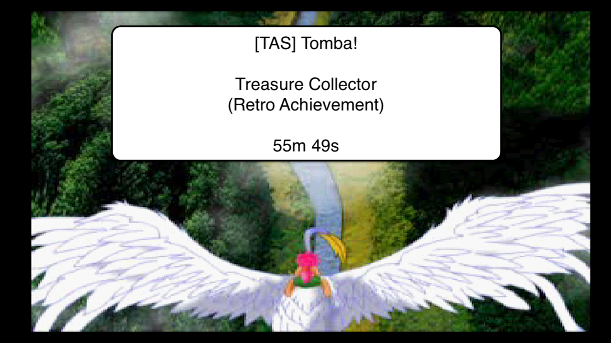
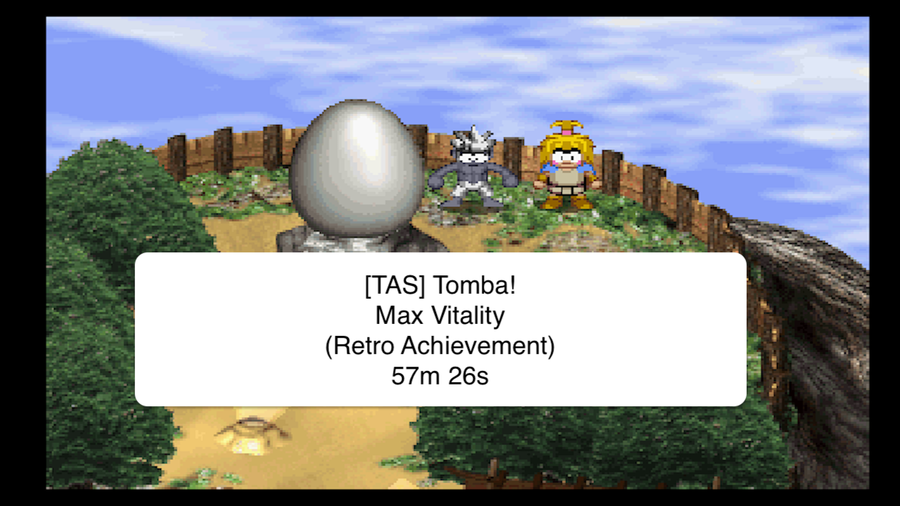

# TAS Tomba! (PS1)

My inspirations for those TAS came from :

- [RTA Any% runs](https://www.speedrun.com/fr-FR/tomba1)
- [TAS Any% run](https://www.youtube.com/watch?v=nc3nrPPxaFM)
- Other various videos

---

## Treasure Collector in 55:49

### Publication

### About

**Treasure Collector** is a retro achievement ([url](https://retroachievements.org/achievement/83159)).

All the chests are opened, and their contents are taken because of this comment on the retro achievement page :
"Be aware that if you open a chest but the treasure falls (like in the mushroom forest or lava cave) then you have to
leave the area and get it to respawn. It won't count because the chest respawns.".

### Chests

To see all the chests' locations, images and timecodes, it's [here](./chests/locations.md).

### Routing

Beyond getting the four old keys, two pigs and five events have to be defeated / done to have the possibility to finish
this category.

#### Pigs

- Green Pig to move inside the Lava Caves
- Pink Pig to unlock some chests only available in the purified Haunted Mansion

#### Events about the thief to get the Boss' Jewel

- The Troubled Thief
- What The Thief Forgot
- The Boss' Treasure

#### Events about the Jewel of Fire to get two chests behind a straw wall

- Mighty Fish Food (only for the red / fire experience)
- Red Hidden Powers

---

## Max Vitality in 57:26

### Publication

### About

**Max Vitality** is a retro achievement ([url](https://retroachievements.org/achievement/80668)).

Starting at 4 pieces of life, 12 "Vitality Max +1" items will be acquired to increase it to 16.
But the Golden Bowl has to be acquired too, else the life pieces will be stuck at 8.

### Routing

Beyond getting the four old keys, the twelve Vitality Max +1 items and encountering Yan seven times, two pigs have to
be defeated to have the possibility to finish this category.

#### Pigs

- Green Pig to move inside the Lava Caves
- Pink Pig to get the chest with the Vitality Max +1 in the Haunted Mansion only available when purified.

Note : In the TAS, the Orange Pig is also killed, but it's quite likely to be a mistake (doesn't seem to be needed, to
be confirmed).

#### Vitality Max +1

The 12 Vitality Max +1 items are dispatched through 7 chests, 4 events (as rewards) and from 1 NPC (the Blue Fortune
Teller).

Timecodes :
- 05:47 : from chest
- 28:23 : from chest
- 33:40 : from chest
- 37:05 : from chest
- 37:30 : from event (Something's Cookin'?)
- 37:49 : from event (Death Fruit Juice)
- 42:11 : from chest
- 43:00 : from chest
- 46:32 : from event (Take Two of These)
- 48:22 : from event (The Mermaid's Singing Rock)
- 48:53 : from NPC (Talk to Blue Fortune Teller with 500.000 AP)
- 49:29 : from chest

#### Yan and the Golden Bowl

As mentioned above, the Golden Bowl is required to be able to increase until 16 pieces of life. The Vitality Max +1
items taken after 8 pieces of life will be kept in memory and be applied only after acquiring the Golden Bowl.

That's why, in the TAS, life pieces go from 8 to 16 at once.

Timecodes :
- 02:08 : Encounter n°1 (starting the event "Who Are You?")
- 05:25 : Encounter n°2 (finishing the event "Who Are You?" and starting the event "Hide and Go Seek")
- 13:58 : Encounter n°3
- 23:41 : Encounter n°4
- 34:28 : Encounter n°5
- 45:10 : Encounter n°6
- 49:58 : Final encounter (finishing the event "Hide and Go Seek" and acquiring the Golden Bowl)

Note : The encounters n°3, n°4, n°5 and n°6 can be done in any order.

---

## Tricks

### Taboo status

The status Taboo is obtained when completing the "Red + Blue = ?" event, and it remains until Tomba's death.

In this situation, Tomba :
- is running faster
- is constantly running (as if the square button was always pushed (except in zenithal views))

Note 1 : Tomba won't be anymore able to open a chest with a high jump and be above the item (to grab it in the air),
he will always be "under" the item.

Note 2 : When landing on an egg from a platform above, Tomba won't auto-grab it, an other jump has to be made to grab
it (except if he's falling from being hurt, at 18:14 in Treasure Collector's TAS).

To give an idea of his speed within this status, here are the results of Tomba running from the right of the screen
to the left (until pressing up to change the camera to go to Mushroom Forest) in the south side of the Haunted Mansion :

- With Taboo (whatever the Pants, same duration) : 200 frames
- Without Taboo + Flash Pants : 215
- Without Taboo + Dashing Pants : 239
- Without Taboo + Jumping Pants : 263

And so, I have the feeling that the sooner Tomba is in Taboo status, the greater the time saved
(just by running / jumping) over time will increase. It could be confirmed with another TAS without Taboo status.

### Skips

Note : Except if I highlight it, I don't know who has originally found those tricks / skips, I've seen them through
videos.

#### Multiple tiny skips / time saves

- Dwarf save animation skips : Tomba has to be "out of sight" of some dwarfs when saved
    - in Treasure Collector TAS at 6:36, 7:25, 7:28 and 7:43
    - in Max Vitality TAS at 7:28, 8:18, 8:21 and 8:53
- Bird Skip : no need to throw this specific bird
    - in Treasure Collector TAS at 18:09
    - in Max Vitality TAS at 19:24
- Jungle Damage Boost : Tomba is ejected to the cage and not in the spikes
    - in Treasure Collector TAS at 27:59
    - in Max Vitality TAS at 29:46
- Wall glitch : When using the grabble or a weapon against a vertical wall, Tomba will be spawn at the top (not sure
which walls are concerned)
    - in Treasure Collector TAS at 25:03
    - in Max Vitality TAS at 49:19
- In zenithal views, if Tomba is running against a diagonal wall with an angle of +/- 45°, he can sometimes run faster
- In Mushroom Forest, just after acquiring a mushroom, if Tomba is busy (grabbing an edge or acquiring a healing
mushroom for example), it will skip the laugh / cry animation

#### Dialog Skip

The first time in Phoenix's Mountain, a ~ 15 seconds discussion with two NPCs will trigger the event The Master Of The
Skies.

To take back control of Tomba at the start of the discussion, read the sign at the frame the two NPCs are displayed,
then cancel the save suggestion.

Done in Treasure Collector TAS at 13:25 and in Max Vitality TAS at 15:18.

#### Pig Bag (Animation) Skip

When acquiring any Pig Bag, there are two animations where Tomba is frozen in place :

- The {} pig bag (Clear!)
- {Location}

To skip them, first a charity wing (or a bell) is needed and has to be able to be used where Tomba is.

Open a chest with the dash (square button) pushed to touch the ground before the pig bag, then use the charity wing on
the last frame before the menu can't be opened anymore.

If the menu is opened before this frame, it's still possible to cancel the menu and to reopen it just after to try to
get the skip.

Pig Bag Skips are done in Treasure Collector TAS at 21:18, 37:24 and 42:49 and in Max Vitality TAS at 22:36
(unnecessary, to be confirmed) and 24:23.

#### Teleport Glitch

Here is the setup for the Unbreakable Wire Skip in the Underground Maze, but it can be done in other zenithal views.

Talk with the NPC (at top right) that triggers The Blue Fortune Teller event, then talk to him a second time, but,
just before any speech bubble is displayed, open the menu, use a Charity Wing and mash the discussion to
cut the flying animation of Tomba to clip through the wall behind him to then reaching the million-year-old man room
by clipping through the wall.

Done in Treasure Collector TAS at 38:03 and in Max Vitality TAS at 43:27.

Note : A Charity Wing, Baron or a Bell has to be used after the talk with the million-year-old man because the two
doors leading to him will be locked and Tomba will be stuck / softlocked.

#### Early Baccus Village

As far as I know, this glitch was originally discovered / mentioned by MisterStealYourGil,
[here](https://www.youtube.com/watch?v=hL54F0RgSjk).

To summarize it, after the Dialog Skip (mentioned above), keep mashing the texts while staying close to the sign.

Then, when the NPC on the right will go down the stairs while opening the text dialog, the control of Tomba can be
taken back and so the trick is to keep the save dialog until Tomba is leaving the area (to the Mushroom Forest).

Somewhere like halfway between Phoenix Mountain and Mushroom Forest, do a save (mandatory) and everything is well done,
after closing the save window, Tomba will be relocated to Baccus Village.

It mainly skips the first ride on the Phoenix and the tiny backtracking inside the Lava Caves to get the Charity Wing
respawn location.

In fine, I can't say for sure if it's faster to do it than the normal path as there's quite some time between two
comparison spots. To do it, an other TAS (or at least this portion) has to be done. I find it nice to be able to show
it inside a TAS.

Done in Max Vitality TAS, started at 15:18, finished at 15:44.