# Chests' locations

There's a guide providing the location of 87 chests
([url](https://github.com/RetroAchievements/guides/wiki/Tomba!-(PlayStation)#treasure-collector-missable)).

Those six additional chests are not listed in it :

| N° | Location         | Type    | Contents         |
|----|------------------|---------|------------------|
| 88 | Phoenix Mountain | 100     | Charity Wings x2 |
| 89 | Phoenix Mountain | 1,000   | Large Lunch Box  |
| 90 | Phoenix Mountain | Million | Iron Boomerang   |
| 91 | Haunted Mansion  | 100     | Cheese x2        |
| 92 | Haunted Mansion  | 1,000   | Lunch Box        |
| 93 | Haunted Mansion  | 1,000   | Boss' Jewel      |

Note : VGCartography on [DeviantArt](https://www.deviantart.com/vgcartography/gallery/79541945/tomba-1997) was a nice
resource too to be sure that no other chest was missed.

The chests will be described in the order of the aforementioned guide, then followed by the six others above.

## Number 01

- Location : Village of All Beginnings 
- Type : 100
- Contents : 100 Year Old Bell
- Timecode : 41:32

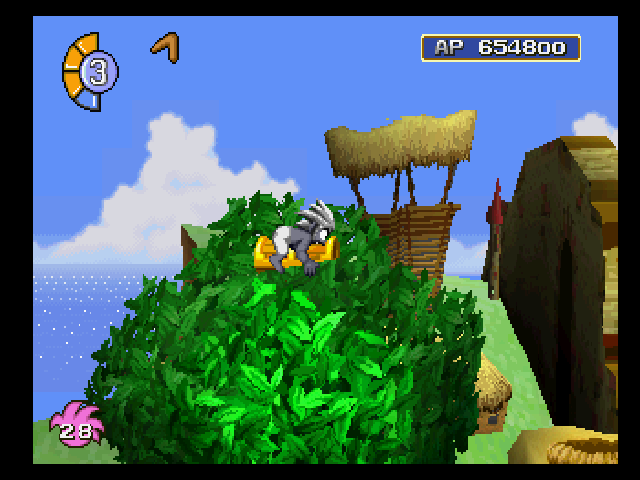

## Number 02

- Location : Forest of All Beginnings  
- Type : 100
- Contents : Charity Wings
- Timecode : 05:11

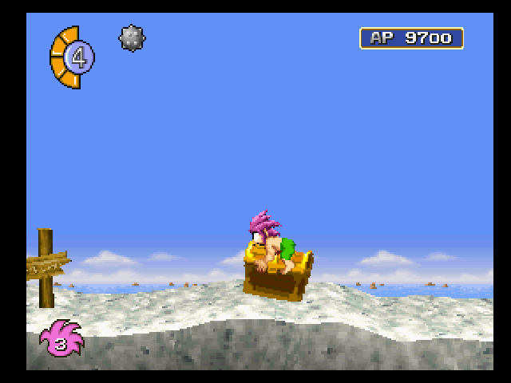

## Number 03

- Location : Forest of All Beginnings  
- Type : 100
- Contents : Max Vitality +1
- Timecode : 41:48

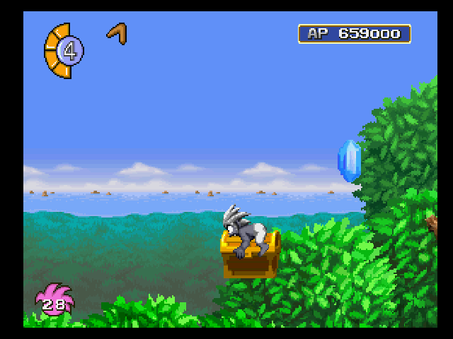

## Number 04

- Location : Forest of All Beginnings
- Type : 10,000
- Contents : Lunch Box
- Timecode : 41:37

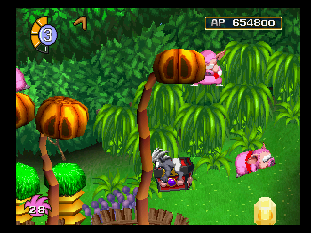

## Number 05

- Location : Ol' Pond
- Type : 10,000
- Contents : 10,000 Year Old Bell
- Timecode : 42:08

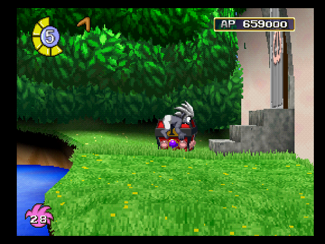

## Number 06

- Location : Mansion                   
- Type : 100
- Contents : Animal Dash (or 20,000 AP Gem if already have it)
- Timecode : 41:24

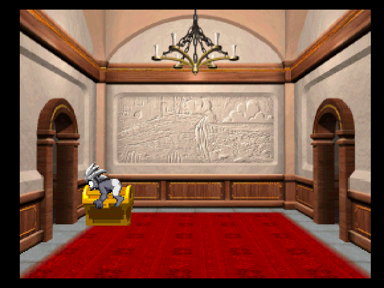

## Number 07

- Location : Mansion
- Type : 1,000
- Contents : Funky Parasol
- Timecode : 41:22

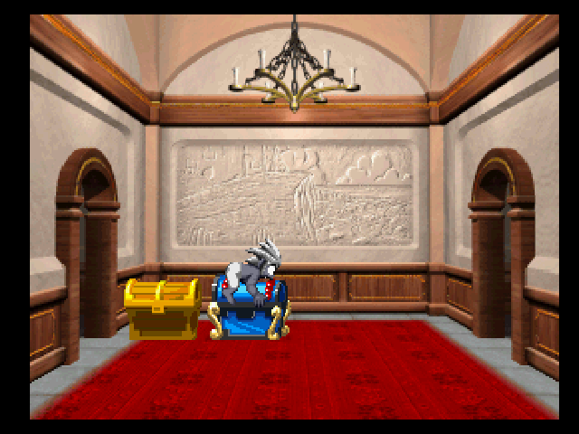

## Number 08

- Location : Mansion
- Type : 10,000
- Contents : 100,000 AP Gem x2
- Timecode : 41:21

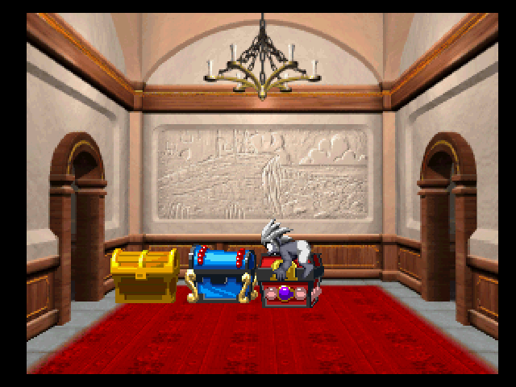

## Number 09

- Location : Mansion
- Type : Million
- Contents : 1 UP x3
- Timecode : 41:20

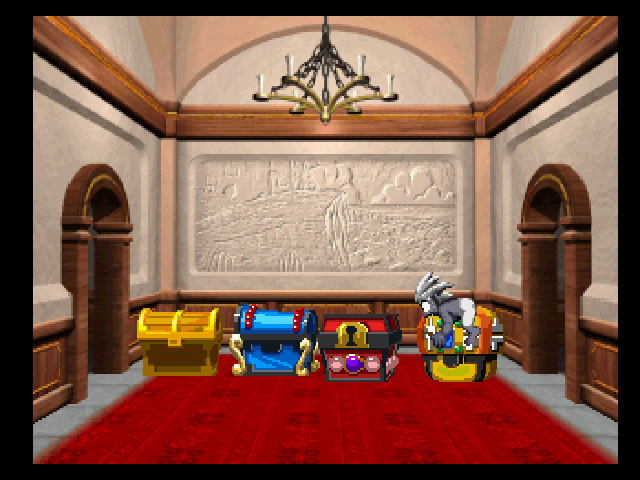

## Number 10

- Location : Forest of 100 Flowers 
- Type : 100
- Contents : Charity Wings x2
- Timecode : 06:30

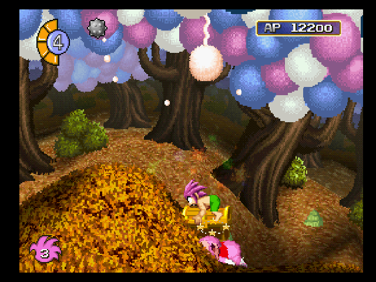

## Number 11

- Location : Forest of 100 Flowers 
- Type : 100
- Contents : Wood Boomerang
- Timecode : 07:21

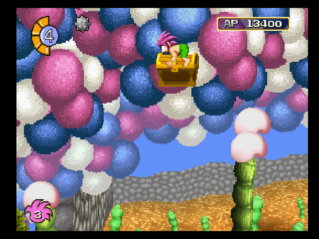

## Number 12

- Location : Forest of 100 Flowers
- Type : 1,000
- Contents : Max Vitality +1
- Timecode : 44:05

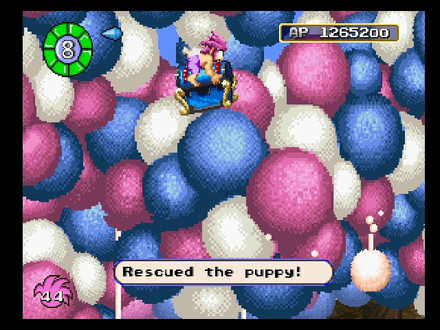

## Number 13

- Location : Dwarf Village
- Type : 1,000
- Contents : Charity Wings
- Timecode : 43:18

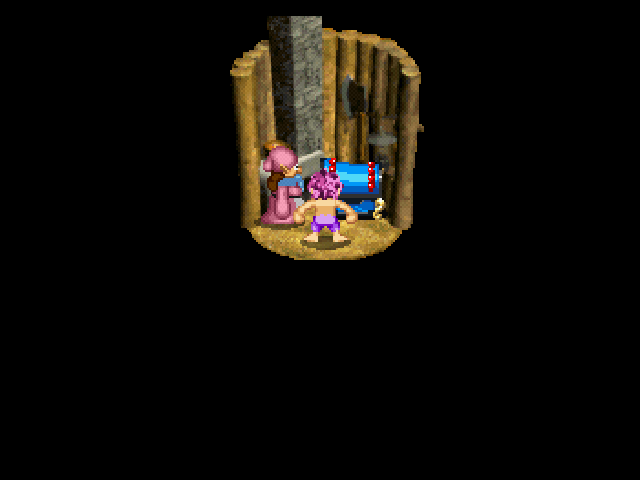

## Number 14

- Location : Watch Tower           
- Type : 100
- Contents : 1 UP x2
- Timecode : 10:53

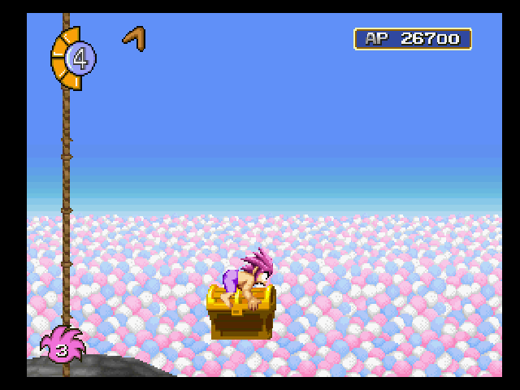

## Number 15

- Location : Watch Tower           
- Type : 100
- Contents : Jumping Pants
- Timecode : 07:58

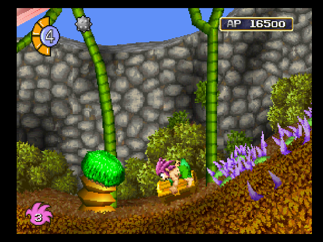

## Number 16

- Location : Watch Tower
- Type : 10,000
- Contents : Large Lunch Box
- Timecode : 43:35

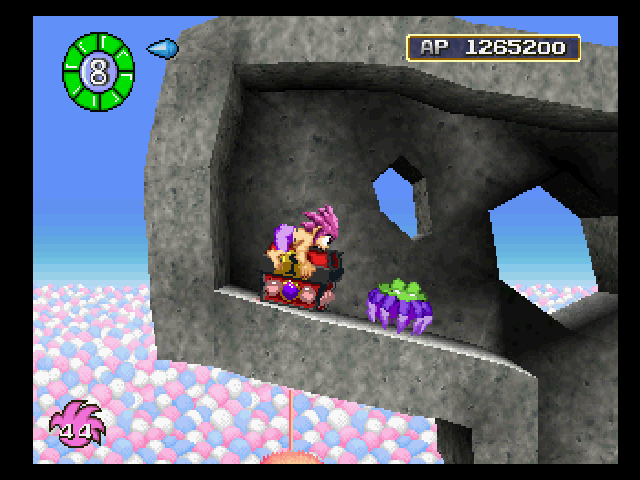

## Number 17

- Location : Watch Tower
- Type : Million
- Contents : Million Year Old Bell
- Timecode : 43:41

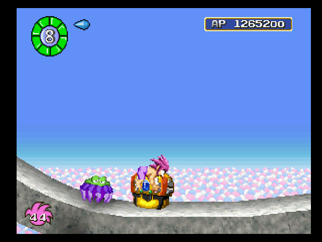

## Number 18

- Location : Wobbly Wharf          
- Type : 100
- Contents : Blue Fruit x2
- Timecode : 07:04

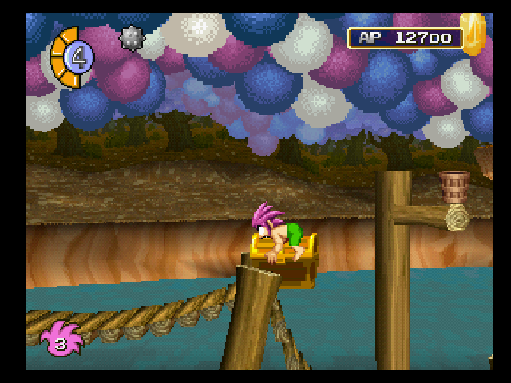

## Number 19

- Location : Charity Square
- Type : 1,000
- Contents : 10,000 AP Gem
- Timecode : 44:22

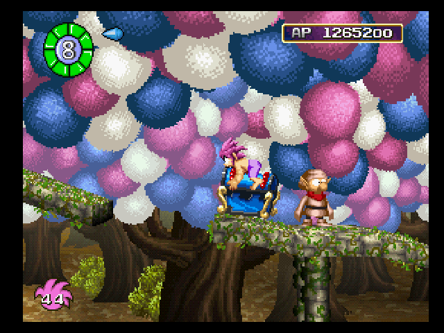

## Number 20

- Location : Charity Square
- Type : 10,000
- Contents : 100,000 AP Gem
- Timecode : 44:30

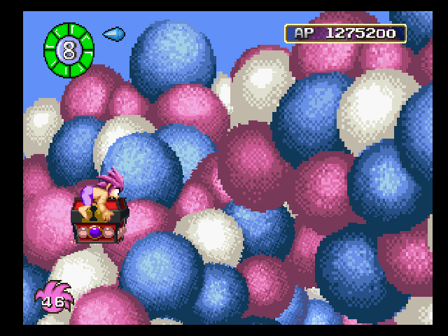

## Number 21

- Location : Charity Square
- Type : Million
- Contents : 1 UP x2
- Timecode : 44:26

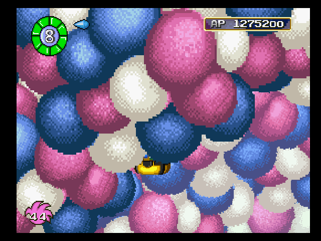

## Number 22

- Location : Mushroom Forest   
- Type : 100
- Contents : 20,000 AP Gem
- Timecode : 40:38

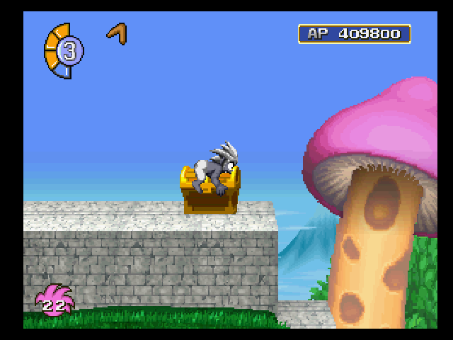

## Number 23

- Location : Mushroom Forest   
- Type : 100
- Contents : Charity Wings
- Timecode : 11:10

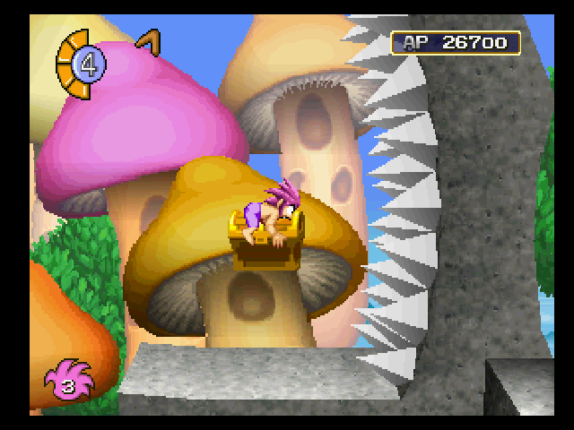

## Number 24

- Location : Mushroom Forest
- Type : 1,000
- Contents : 1 UP
- Timecode : 40:17

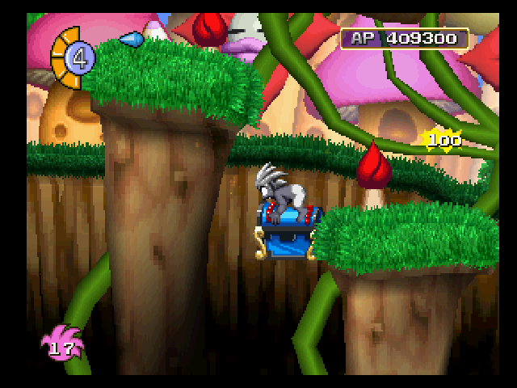

## Number 25

- Location : Mushroom Forest
- Type : 1,000
- Contents : 1 UP
- Timecode : 40:23

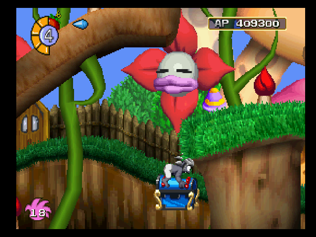

## Number 26

- Location : Mushroom Forest
- Type : 1,000
- Contents : 1,000 Year Old Bell
- Timecode : 40:33

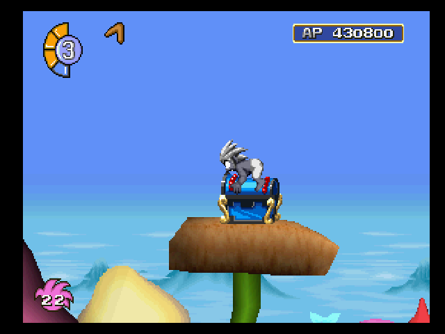

## Number 27

- Location : Mushroom Forest
- Type : 1,000
- Contents : Charity Wings
- Timecode : 40:24

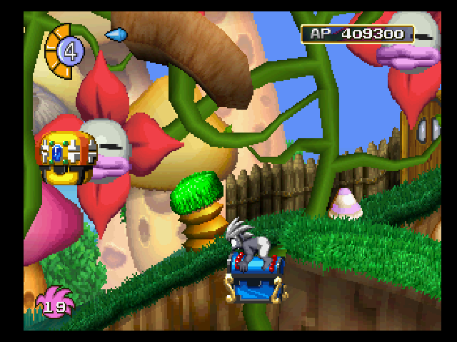

## Number 28

- Location : Mushroom Forest
- Type : 1,000
- Contents : Charity Wings
- Timecode : 40:35

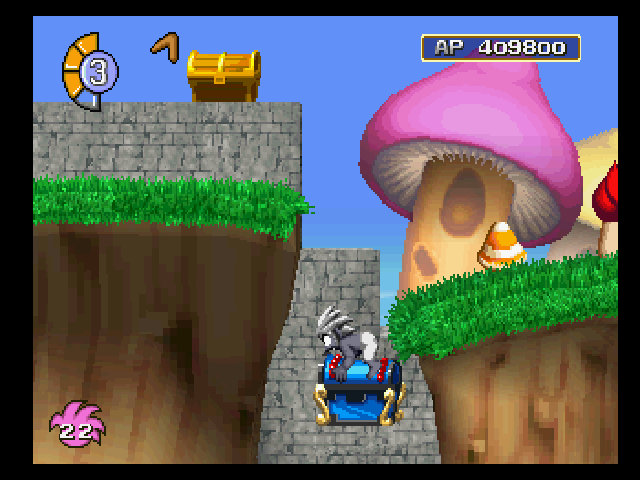

## Number 29

- Location : Mushroom Forest
- Type : 1,000
- Contents : Mysterious Mushroom
- Timecode : 40:20

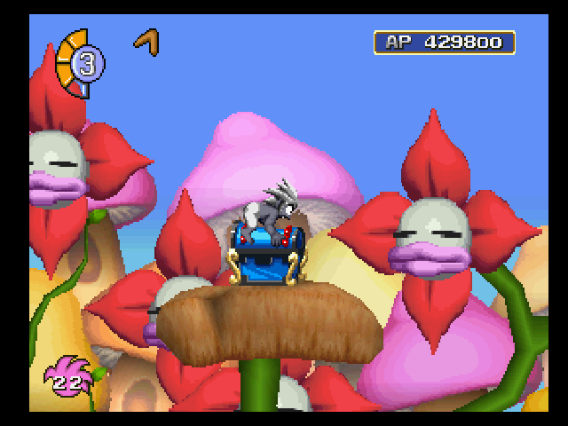

## Number 30

- Location : Mushroom Forest
- Type : 10,000
- Contents : 1 UP
- Timecode : 40:29

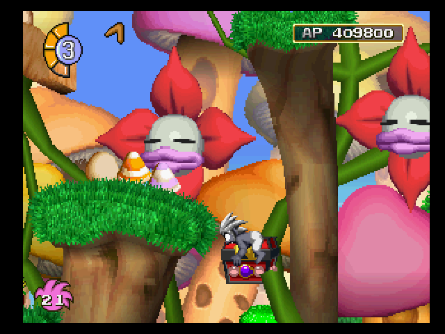

## Number 31

- Location : Mushroom Forest
- Type : 10,000
- Contents : Charity Wings
- Timecode : 40:28

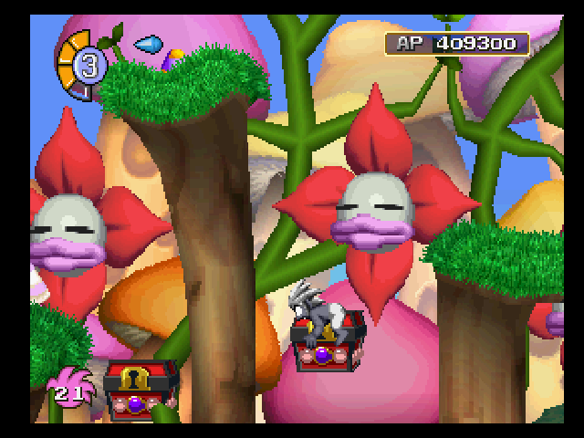

## Number 32

- Location : Mushroom Forest
- Type : Million
- Contents : 1 UP x2
- Timecode : 40:25

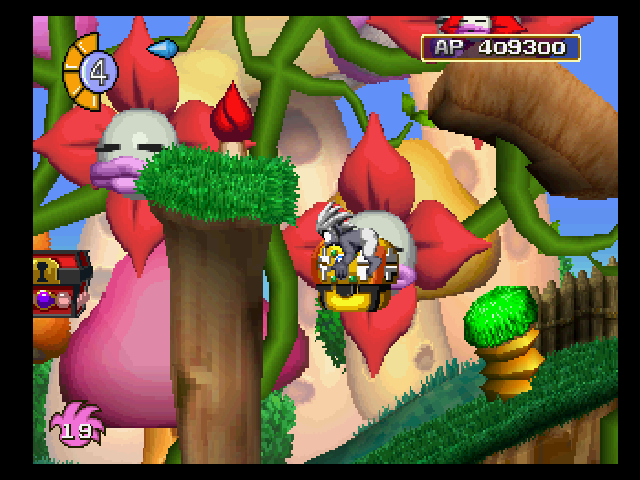

## Number 33

- Location : Phoenix Mountain  
- Type : 100
- Contents : Dashing Pants
- Timecode : 45:27

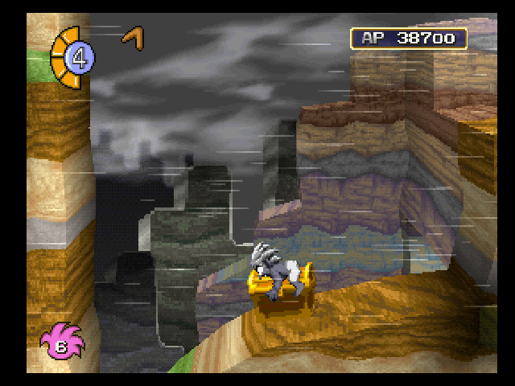

## Number 34

- Location : Phoenix Mountain  
- Type : 100
- Contents : Lunch Box
- Timecode : 13:33

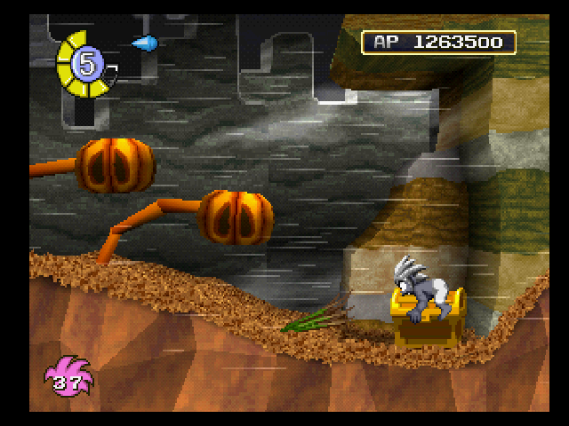

## Number 35

- Location : Phoenix Mountain
- Type : 1,000
- Contents : 1 UP x2
- Timecode : 45:00

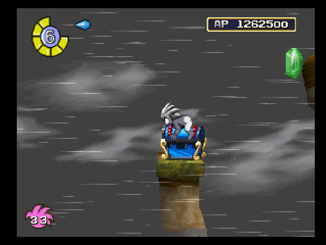

## Number 36

- Location : Phoenix Mountain
- Type : 1,000
- Contents : Grapple
- Timecode : 21:52

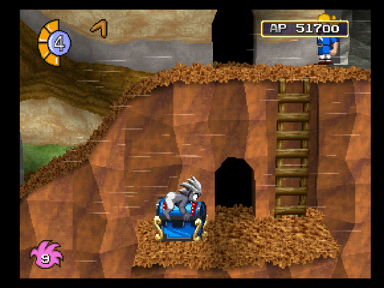

## Number 37

- Location : Phoenix Mountain
- Type : 10,000
- Contents : 1 UP x2
- Timecode : 45:04

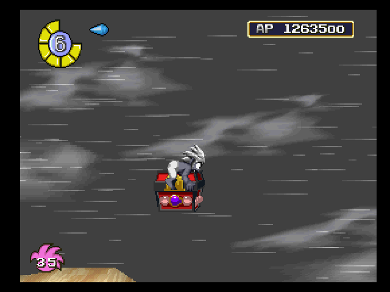

## Number 38

- Location : Phoenix Mountain
- Type : Million
- Contents : Max Vitality +1
- Timecode : 45:25

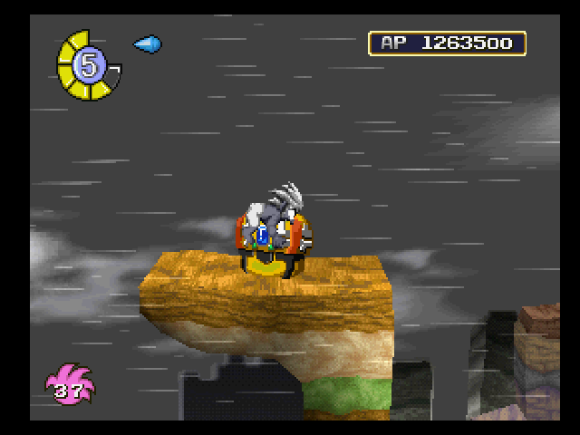

## Number 39

- Location : Lava Caves        
- Type : 100
- Contents : 1 UP
- Timecode : 45:52

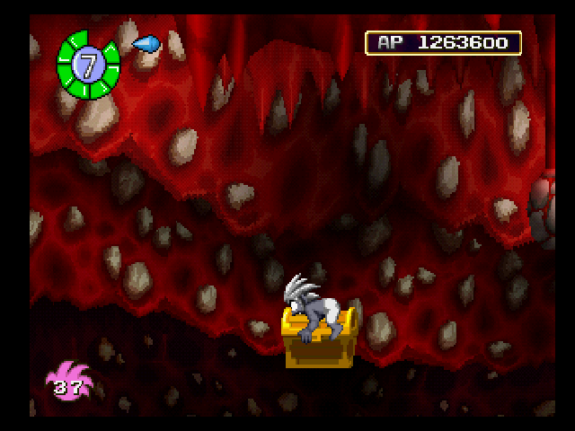

## Number 40

- Location : Lava Caves        
- Type : 100
- Contents : Lunch Box
- Timecode : 45:49

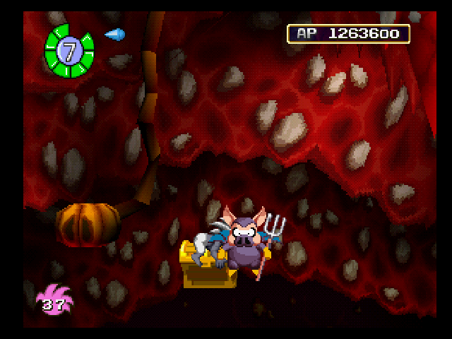

## Number 41

- Location : Lava Caves        
- Type : 100
- Contents : Max Vitality +1
- Timecode : 46:05

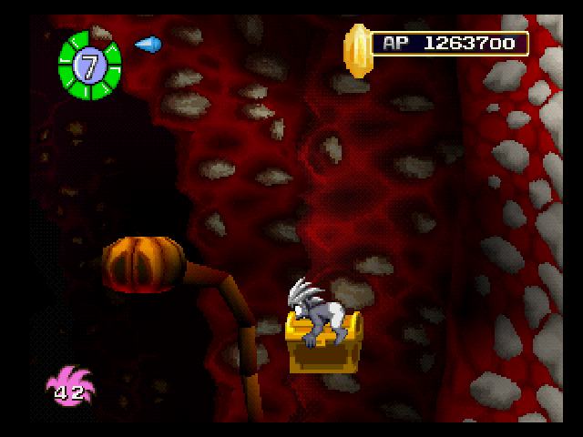

## Number 42

- Location : Lava Caves
- Type : 1,000
- Contents : 1 UP
- Timecode : 45:57

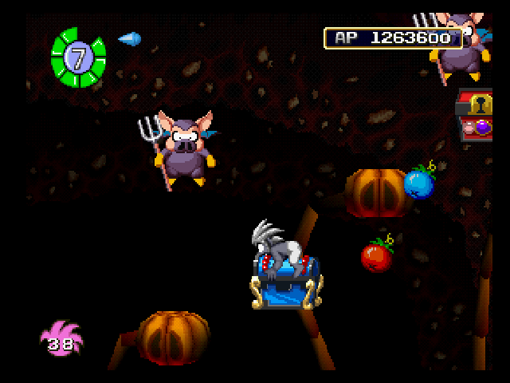

## Number 43

- Location : Lava Caves
- Type : 1,000
- Contents : 1 UP x2
- Timecode : 46:15

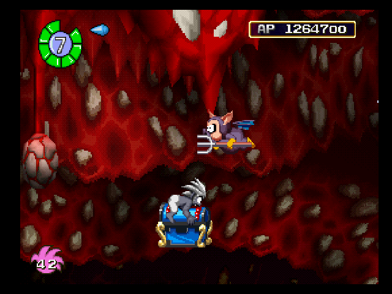

## Number 44

- Location : Lava Caves
- Type : 1,000
- Contents : Charity Wings x2
- Timecode : 25:52

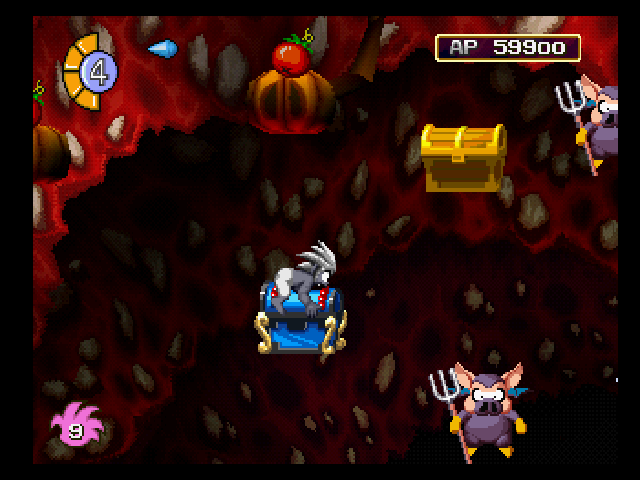

## Number 45

- Location : Lava Caves
- Type : 1,000
- Contents : Green Evil Pig Bag
- Timecode : 21:30

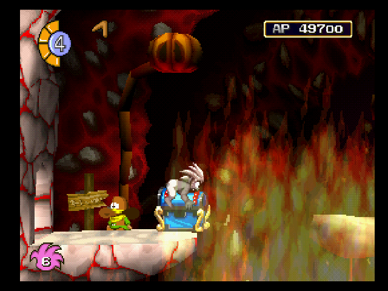

## Number 46

- Location : Lava Caves
- Type : 10,000
- Contents : 1 UP
- Timecode : 46:02

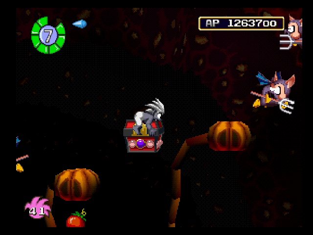

## Number 47

- Location : Lava Caves
- Type : 10,000
- Contents : 1 UP
- Timecode : 46:19

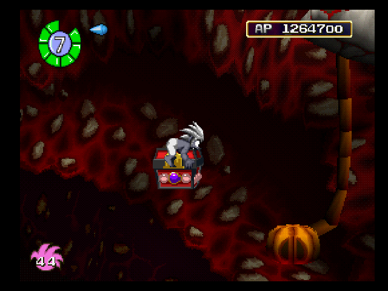

## Number 48

- Location : Lava Caves
- Type : 10,000
- Contents : Charity Wings x2
- Timecode : 45:55

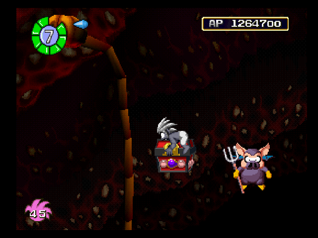

## Number 49

- Location : Lava Caves
- Type : Million
- Contents : 1 UP x2
- Timecode : 46:00

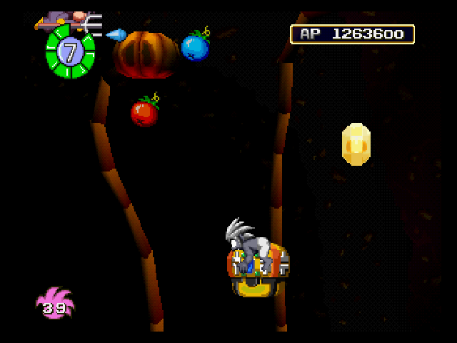

## Number 50

- Location : Lava Caves
- Type : Million
- Contents : Large Lunch Box
- Timecode : 46:10

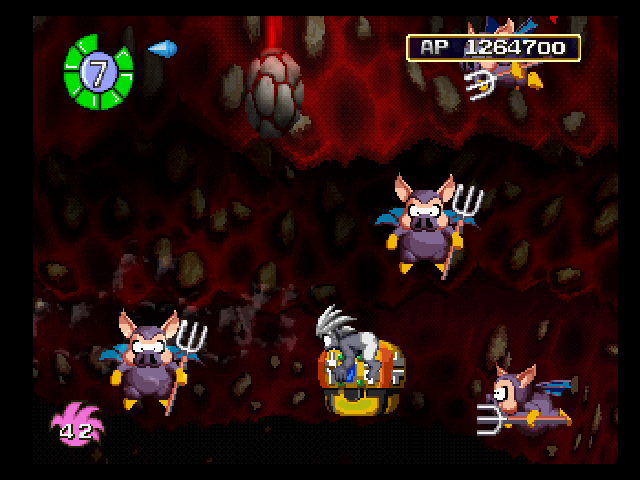

## Number 51

- Location : Baccus Village
- Type : 1,000
- Contents : Orange Evil Pig Bag
- Timecode : 21:17

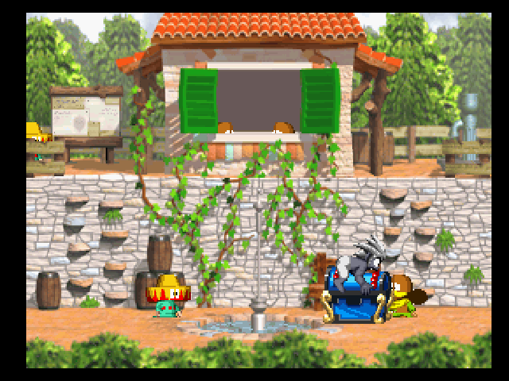

## Number 52

- Location : Haunted Mansion   
- Type : 100
- Contents : Red Fruit x4
- Timecode : 49:32

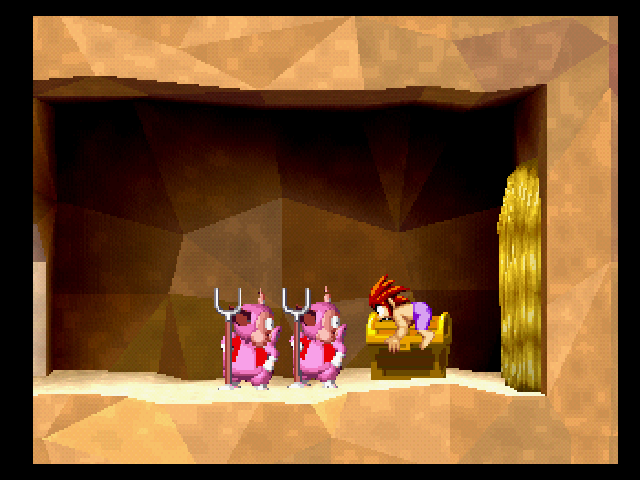

## Number 53

- Location : Haunted Mansion
- Type : 1,000
- Contents : Large Lunch Box
- Timecode : 46:49

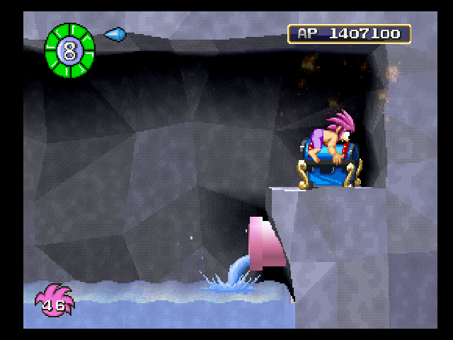

## Number 54

- Location : Haunted Mansion
- Type : 1,000
- Contents : Pink Evil Pig Bag
- Timecode : 24:30

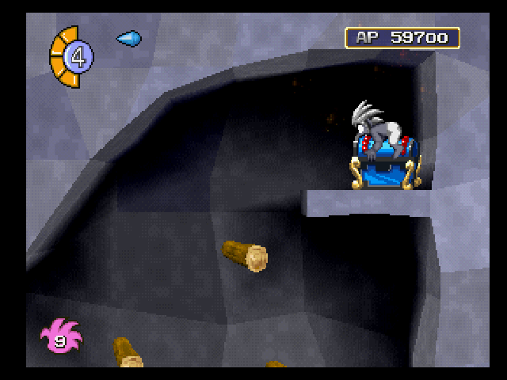

## Number 55

- Location : Haunted Mansion
- Type : 1,000
- Contents : Stone Boomerang
- Timecode : 35:06

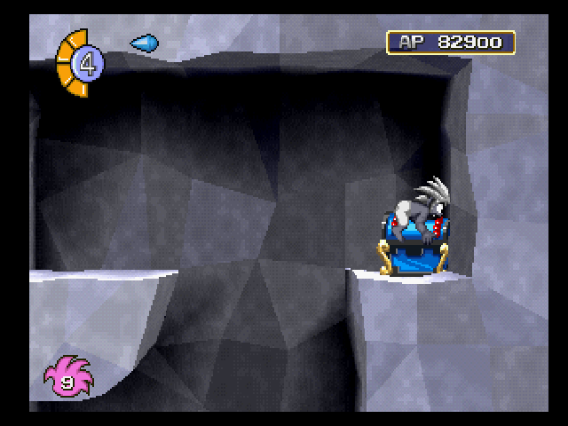

## Number 56

- Location : Haunted Mansion
- Type : 1,000
- Contents : Max Vitality +1
- Timecode : 48:43

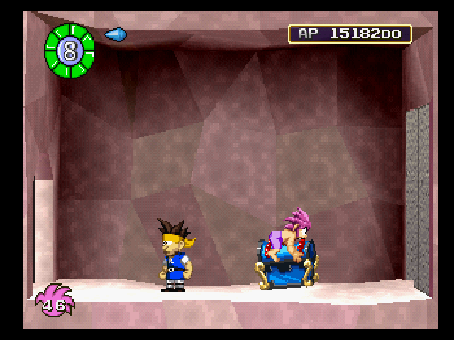

## Number 57

- Location : Haunted Mansion
- Type : 10,000
- Contents : Large Lunch Box
- Timecode : 47:16

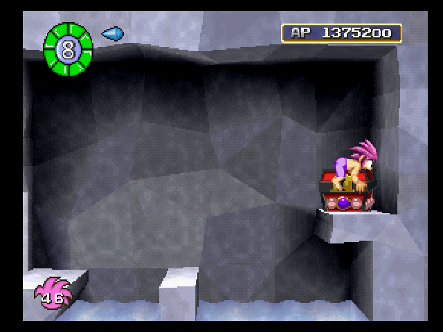

## Number 58

- Location : Haunted Mansion
- Type : Million
- Contents : Large Lunch Box
- Timecode : 49:08

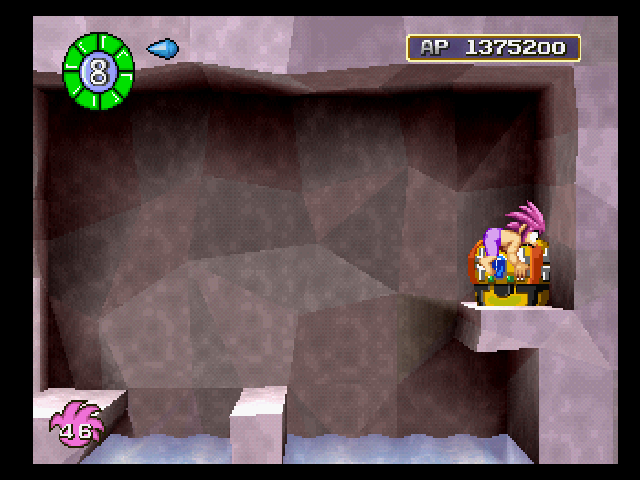

## Number 59

- Location : Masakari Jungle   
- Type : 100
- Contents : Funga Drum
- Timecode : 27:31

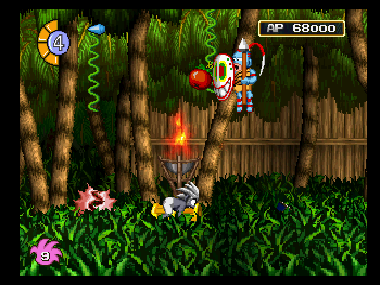

## Number 60

- Location : Masakari Jungle   
- Type : 100
- Contents : Large Lunch Box
- Timecode : 32:15

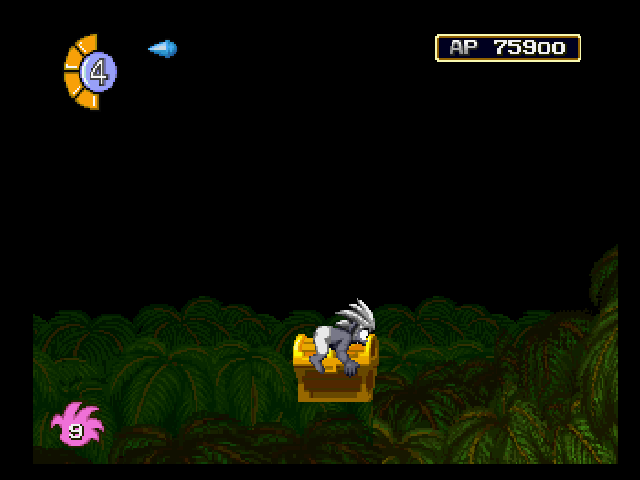

## Number 61

- Location : Masakari Jungle
- Type : 1,000
- Contents : Max Vitality +1
- Timecode : 32:14

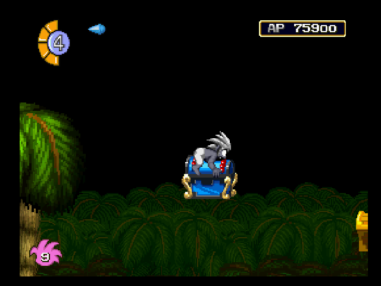

## Number 62

- Location : Masakari Jungle
- Type : 10,000
- Contents : Flash Pants
- Timecode : 43:06

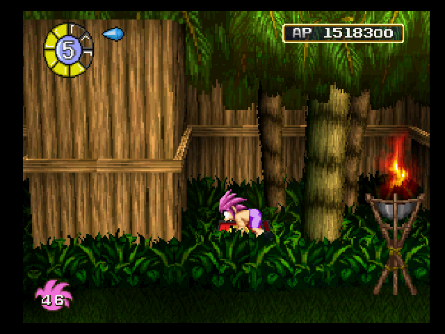

## Number 63

- Location : Old Tree Hill
- Type : 10,000
- Contents : Navy Evil Pig Bag
- Timecode : 42:48

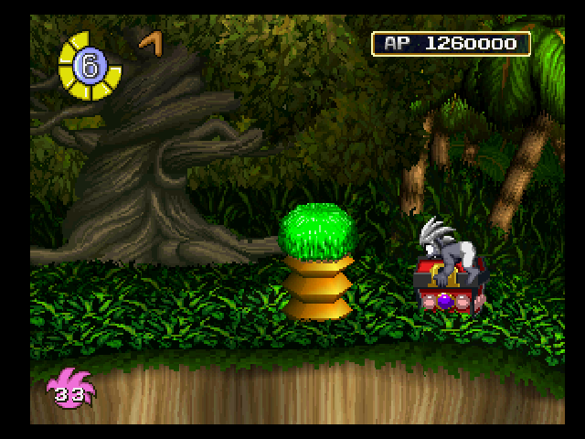

## Number 64

- Location : Old Tree Hill
- Type : Million
- Contents : 500,000 AP Gem
- Timecode : 42:46

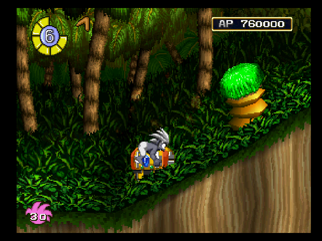

## Number 65

- Location : Trick Village
- Type : 1,000
- Contents : Charity Wings
- Timecode : 36:30

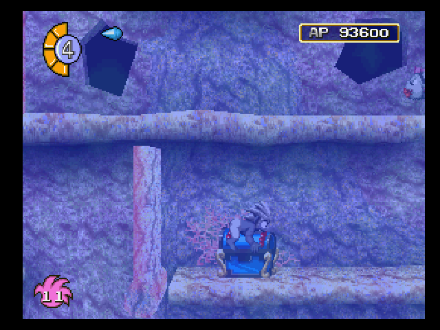

## Number 66

- Location : Trick Village
- Type : 1,000
- Contents : Charity Wings
- Timecode : 36:35

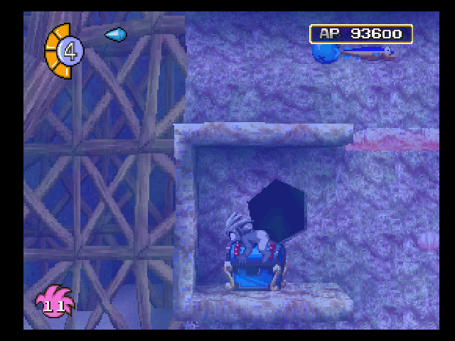

## Number 67

- Location : Trick Village
- Type : 1,000
- Contents : Large Lunch Box
- Timecode : 36:26

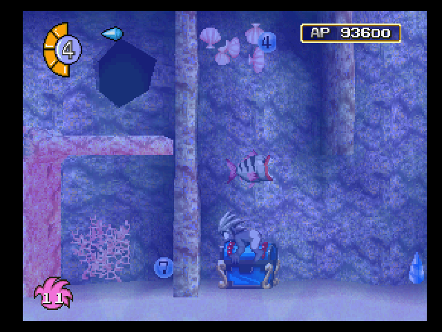

## Number 68

- Location : Trick Village
- Type : 1,000
- Contents : Seashell Necklace
- Timecode : 34:36

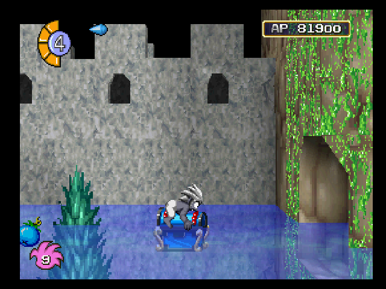

## Number 69

- Location : Trick Village
- Type : 10,000
- Contents : 100,000 AP Gem
- Timecode : 42:30

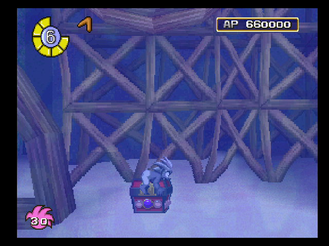

## Number 70

- Location : Trick Village
- Type : 10,000
- Contents : Max Vitality +1
- Timecode : 37:16

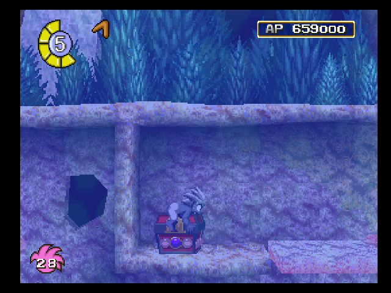

## Number 71

- Location : Trick Village
- Type : 10,000
- Contents : Yellow Evil Pig Bag
- Timecode : 42:23

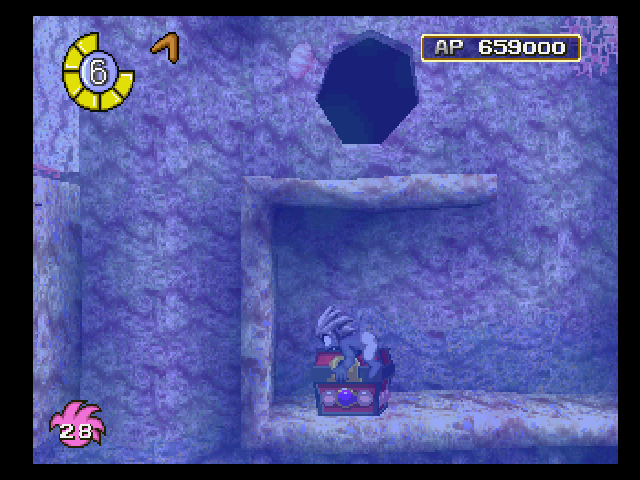

## Number 72

- Location : Trick Village
- Type : Million
- Contents : 1 UP x2
- Timecode : 37:23

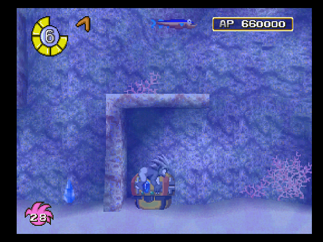

## Number 73

- Location : Underground Maze  
- Type : 100
- Contents : Charity Wings x2
- Timecode : 39:13

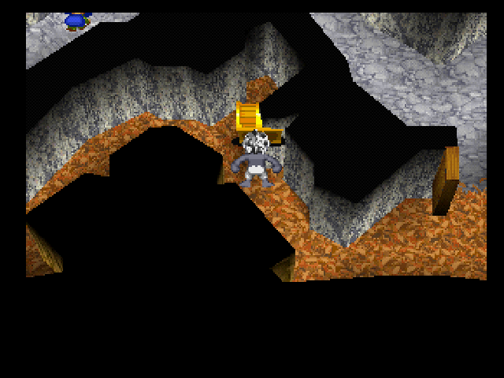

## Number 74

- Location : Underground Maze  
- Type : 100
- Contents : Cheese
- Timecode : 38:02

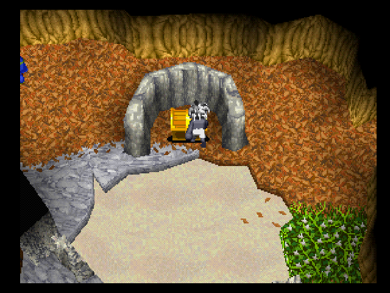

## Number 75

- Location : Underground Maze  
- Type : 100
- Contents : Cheese
- Timecode : 40:02

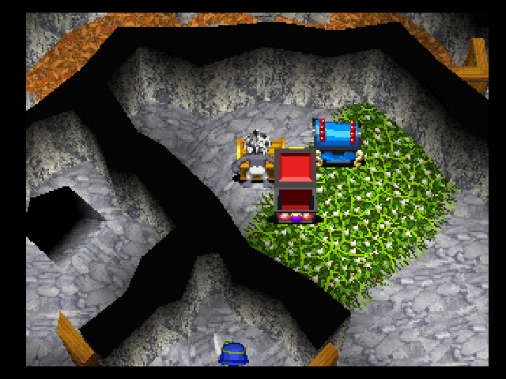

## Number 76

- Location : Underground Maze  
- Type : 100
- Contents : Lunch Box
- Timecode : 39:28

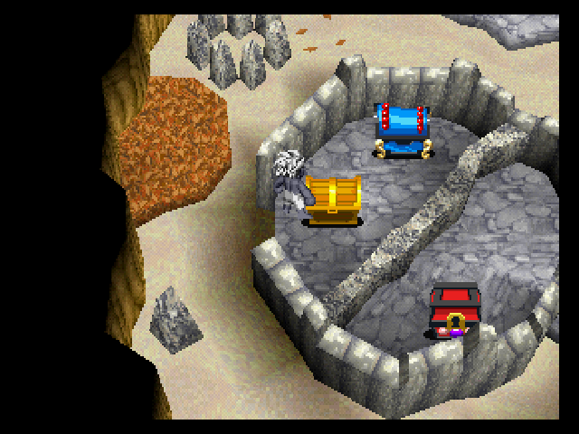

## Number 77

- Location : Underground Maze
- Type : 1,000
- Contents : Biting Flower Plant
- Timecode : 39:27

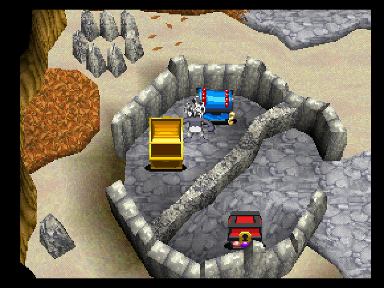

## Number 78

- Location : Underground Maze
- Type : 1,000
- Contents : Cheese
- Timecode : 39:24

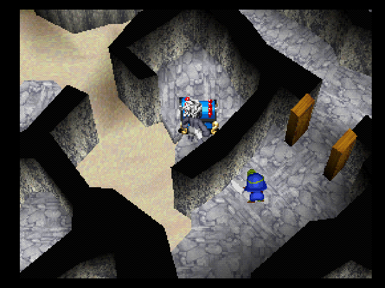

## Number 79

- Location : Underground Maze
- Type : 1,000
- Contents : Cheese
- Timecode : 39:49

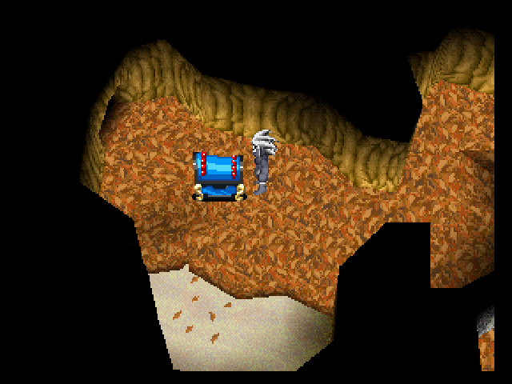

## Number 80

- Location : Underground Maze
- Type : 1,000
- Contents : Lunch Box
- Timecode : 40:02

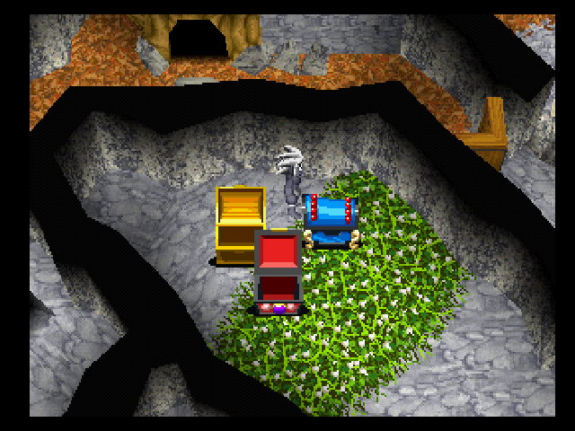

## Number 81

- Location : Underground Maze
- Type : 1,000
- Contents : Needlegator Teeth
- Timecode : 38:55

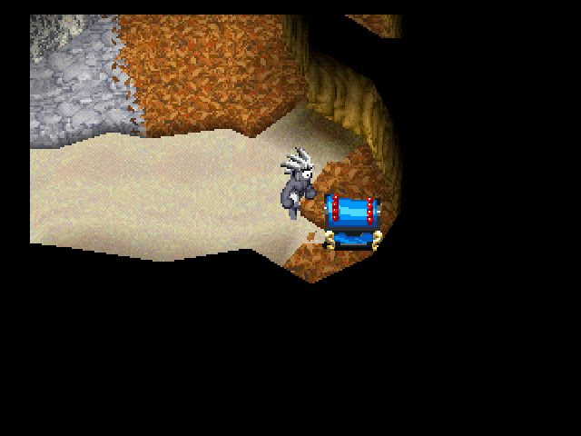

## Number 82

- Location : Underground Maze
- Type : 10,000
- Contents : Butamushi Thorn
- Timecode : 39:10

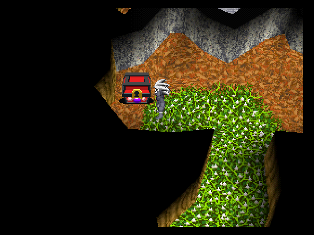

## Number 83

- Location : Underground Maze
- Type : 10,000
- Contents : Charity Wings x2
- Timecode : 39:31

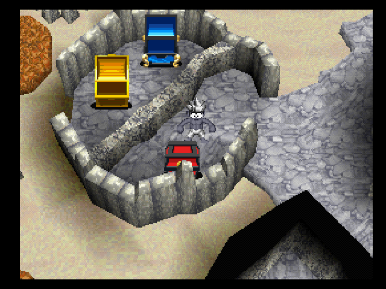

## Number 84

- Location : Underground Maze
- Type : 10,000
- Contents : Cheese
- Timecode : 38:51

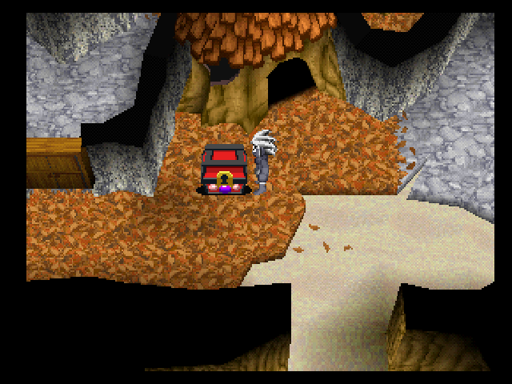

## Number 85

- Location : Underground Maze
- Type : 10,000
- Contents : Cold Medicine
- Timecode : 38:55

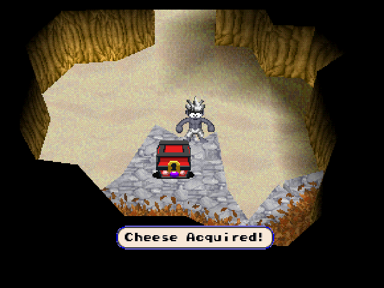

## Number 86

- Location : Underground Maze
- Type : 10,000
- Contents : Kokka Claw
- Timecode : 40:02

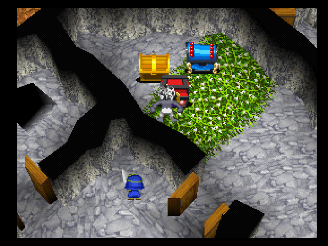

## Number 87

- Location : Underground Maze
- Type : Million
- Contents : 300,000 AP
- Timecode : 39:38

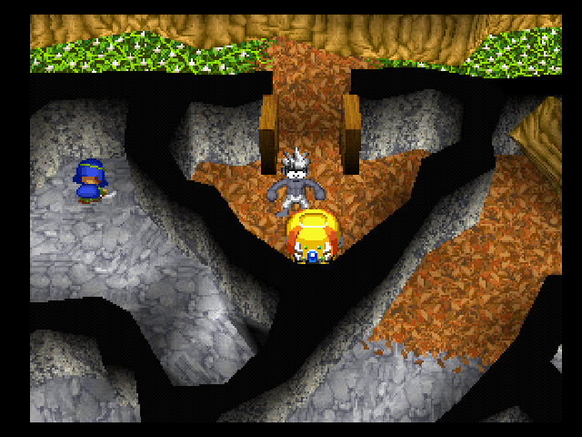

## Number 88

- Location : Phoenix Mountain
- Type : 100
- Contents : Charity Wings x2
- Timecode : 14:16

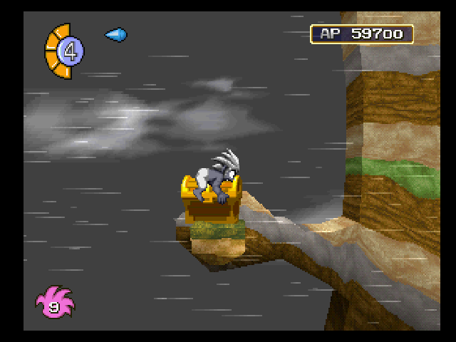

## Number 89

- Location : Phoenix Mountain
- Type : 1,000
- Contents : Large Lunch Box
- Timecode : 44:49

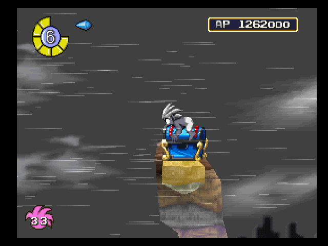

## Number 90

- Location : Phoenix Mountain
- Type : Million
- Contents : Iron Boomerang
- Timecode : 45:07

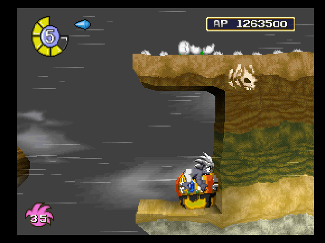

## Number 91

- Location : Haunted Mansion
- Type : 100
- Contents : Cheese x2
- Timecode : 49:34

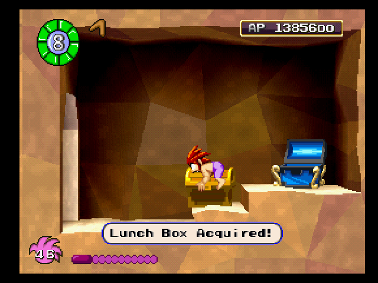

## Number 92

- Location : Haunted Mansion
- Type : 1,000
- Contents : Lunch Box
- Timecode : 49:35

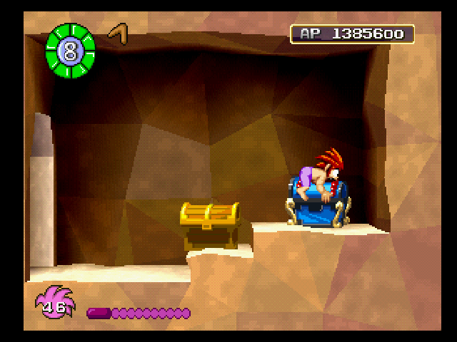

## Number 93

- Location : Haunted Mansion
- Type : 1,000
- Contents : Boss' Jewel
- Timecode : 48:20

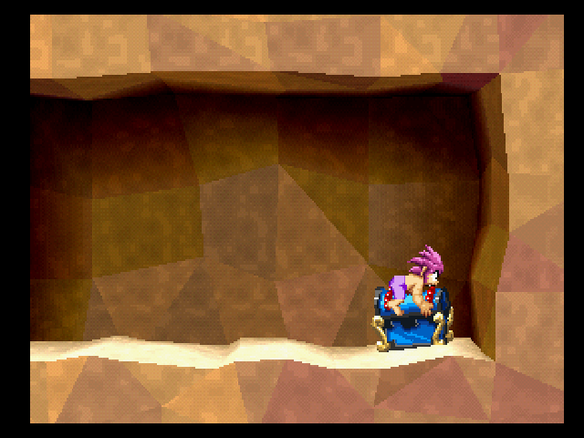

---

## Chests ordered by timecodes

- 05:11 - [N°02](#number-02)
- 06:30 - [N°10](#number-10)
- 07:04 - [N°18](#number-18)
- 07:21 - [N°11](#number-11)
- 07:58 - [N°15](#number-15)
- 10:53 - [N°14](#number-14)
- 11:10 - [N°23](#number-23)
- 13:33 - [N°34](#number-34)
- 14:16 - [N°88](#number-88)
- 21:17 - [N°51](#number-51)
- 21:30 - [N°45](#number-45)
- 21:52 - [N°36](#number-36)
- 24:30 - [N°54](#number-54)
- 25:52 - [N°44](#number-44)
- 27:31 - [N°59](#number-59)
- 32:14 - [N°61](#number-61)
- 32:15 - [N°60](#number-60)
- 34:36 - [N°68](#number-68)
- 35:06 - [N°55](#number-55)
- 36:26 - [N°67](#number-67)
- 36:30 - [N°65](#number-65)
- 36:35 - [N°66](#number-66)
- 37:16 - [N°70](#number-70)
- 37:23 - [N°71](#number-71)
- 38:02 - [N°74](#number-74)
- 38:51 - [N°84](#number-84)
- 38:55 - [N°81](#number-81)
- 38:55 - [N°85](#number-85)
- 39:10 - [N°82](#number-82)
- 39:13 - [N°73](#number-73)
- 39:24 - [N°78](#number-78)
- 39:27 - [N°77](#number-77)
- 39:28 - [N°76](#number-76)
- 39:31 - [N°83](#number-83)
- 39:38 - [N°87](#number-87)
- 39:49 - [N°79](#number-79)
- 40:02 - [N°80](#number-80)
- 40:02 - [N°75](#number-75)
- 40:02 - [N°86](#number-86)
- 40:17 - [N°24](#number-24)
- 40:20 - [N°29](#number-29)
- 40:23 - [N°25](#number-25)
- 40:24 - [N°27](#number-27)
- 40:25 - [N°32](#number-32)
- 40:28 - [N°31](#number-31)
- 40:29 - [N°30](#number-30)
- 40:33 - [N°26](#number-26)
- 40:35 - [N°28](#number-28)
- 40:38 - [N°22](#number-22)
- 41:20 - [N°09](#number-09)
- 41:21 - [N°08](#number-08)
- 41:22 - [N°07](#number-07)
- 41:24 - [N°06](#number-06)
- 41:32 - [N°01](#number-01)
- 41:37 - [N°04](#number-04)
- 41:48 - [N°03](#number-03)
- 42:08 - [N°05](#number-05)
- 42:23 - [N°72](#number-72)
- 42:30 - [N°69](#number-69)
- 42:46 - [N°64](#number-64)
- 42:48 - [N°63](#number-63)
- 43:06 - [N°62](#number-62)
- 43:18 - [N°13](#number-13)
- 43:35 - [N°16](#number-16)
- 43:41 - [N°17](#number-17)
- 44:05 - [N°12](#number-12)
- 44:22 - [N°19](#number-19)
- 44:26 - [N°21](#number-21)
- 44:30 - [N°20](#number-20)
- 44:49 - [N°89](#number-89)
- 45:00 - [N°35](#number-35)
- 45:04 - [N°37](#number-37)
- 45:07 - [N°90](#number-90)
- 45:25 - [N°38](#number-38)
- 45:27 - [N°33](#number-33)
- 45:49 - [N°40](#number-40)
- 45:52 - [N°39](#number-39)
- 45:55 - [N°48](#number-48)
- 45:57 - [N°42](#number-42)
- 46:00 - [N°49](#number-49)
- 46:02 - [N°46](#number-46)
- 46:05 - [N°41](#number-41)
- 46:10 - [N°50](#number-50)
- 46:15 - [N°43](#number-43)
- 46:19 - [N°47](#number-47)
- 46:49 - [N°53](#number-53)
- 47:16 - [N°57](#number-57)
- 48:20 - [N°93](#number-93)
- 48:43 - [N°56](#number-56)
- 49:08 - [N°58](#number-58)
- 49:32 - [N°52](#number-52)
- 49:34 - [N°91](#number-91)
- 49:35 - [N°92](#number-92)
